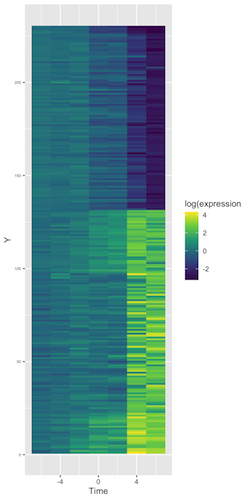

 

# Jason Moggridge, B.Sc. Biochemistry
 

***
## Background
 

Hi, I'm a biologist interested in molecular biology, biochemistry & genetics. 
My research mainly focuses on hypometabolism and adaptive strategies to deal with environmental stress in hibernators and estivators  

  + Find [my journal publications on ORCID](https://orcid.org/0000-0003-1291-5868)
  
  + recent [*cirriculum vitae*] (*link to pdf)
  
  + I hope to add more interactive notebooks and science communication content shortly.

Please check back in soon, thanks!

 

 

# Ref:

----

